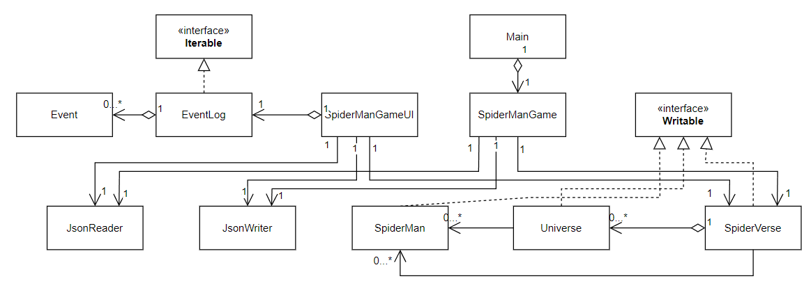

# Spider-Verse

## Background
This project is inspired by the **Marvel Spider-Man** movies. Spider-Verse is a multiverse
that connects all versions of Spider-Man from across the multiverse.
The idea is that every universe that has a Spider hero they are part of this great web.

Spider-Man Miguel from Earth-928B, leader of the Spider Society, believes that each of the Spider hero has to go
through a **"canon event"** such as the death of a police captain
close to Spider-Man, and straying from those events threatens r
. However, Spider-Man Miles from Earth-1610,
who doesn't believe the canon event theory, wants to stop his uncle from being murdered without causing
his universe to collapse.

## Proposal
In this application, the users will be able to participate this Spider-Verse by adding
new Spider heroes as well as choosing them to be either supporters or opponents of the cannon event theory.
Then the corresponding universe will reveal the result based on the choice at the end.

The users will be able to:
- create new Spider heroes with name, universeID, stance for supporter or opponent
- view the list of all spider heroes in a specific universe, with their stance
- view the list of all spider heroes in all universes
- view the list of supporters in all universes
- view the list of opponents in all universes
- view the list of safe universes
- view the list of collapsed universes
- view the list of all universes
- save my created characters to file (if I so choose)
- load my previously created characters from file (if I so choose)

# Instructions for Grader

- You can create a new spider hero character by clicking the "Create a New Spider Hero"
button on the Control Panel, and input name, universe ID you want to live, and stance
for supporter or opponent for the "canon event"
- You can create more spider hero characters by doing the same procedures
mentioned above
- You can save the game status by clicking the
"Save game" button on the Control Panel
- You can load the previously saved game status by clicking the
"Load game" button on the Control Panel
- You can view the spider hero(es) in a given universe by clicking the
"View Spider heroes by universe ID" button on the Control Panel and input the 
universe ID
- You can view the spider heroes in all universes by clicking the
  "View Spider heroes in all universes" button on the Control Panel 
- You can view the spider heroes that are supporters in all universes by clicking the
"View supporters in all universes" button on the Control Panel
- You can view the spider heroes that are opponents in all universes by clicking the
  "View opponents in all universes" button on the Control Panel
- You can view all the safe universes by clicking the
  "View safe universes" button on the Control Panel
- You can view all the collapsed universes by clicking the
  "View collapsed universes" button on the Control Panel
- You can view all the universes by clicking the
  "View all universes" button on the Control Panel

# Phase 4: Task 2
Sample of the events that occur when this program runs:
- Wed Aug 09 11:09:26 PDT 2023
  - Universe - 1 now has its first spider hero!
- Wed Aug 09 11:09:26 PDT 2023
  - Created a new character: Jack, Universe ID: 1, Stance: Opponent
- Wed Aug 09 11:09:31 PDT 2023
  - Universe - 2 now has its first spider hero!
- Wed Aug 09 11:09:31 PDT 2023
  - Created a new character: Amy, Universe ID: 2, Stance: Supporter
- Wed Aug 09 11:09:37 PDT 2023
  - Created a new character: Terry, Universe ID: 2, Stance: Opponent

# Phase 4: Task 3
Refactored some of the structure, such as deleted the single Universe field in 
SpiderVerse class but leave Universe set field untouched. This is because one
SpiderVerse contains a set of universes, it would be redundant to add
another single Universe field.

If there is more time, I will also delete the SpiderMan set field in 
SpiderVerse, because SpiderMan should only be part of the Universe
class, I can get it in SpiderVerse just by calling getter method in the 
Universe set field so as to make the UML diagram clearer.

  